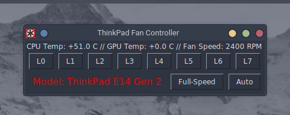

# Thinkpad Fan Tweaker GUI

<p align="left">
  <a href="https://github.com/krygeNNN/thinkpadfan-gui">
    
  </a>
<p align="center">
  <a href="https://github.com/krygeNNN/thinkpadfan-gui">
    
  </a>

## Description

Spesifically designed for ThinkPad/IBM laptops to twek fan speed with an graphical user interface.
You can also monitor CPU, GPU temperatures.

## Getting Started

### Dependencies

* python3 libraries --> tkinter, subprocess, shlex
* Any Linux kernel

### Installing

* git clone https://github.com/krygeNNN/thinkpadfan-gui.git
* pip3 install -r requirements.txt
 ```
  git clone https://github.com/krygeNNN/thinkpadfan-gui.git
  pip3 install -r requirements.txt
  ```
 

### Setup

* How to run the program
* Step-by-step bullets
```
code blocks for commands
```

## Help

Any advise for common problems or issues.
```
command to run if program contains helper info
```

## Authors

Contributors names and contact info

ex. Dominique Pizzie  
ex. [@DomPizzie](https://instagram.com/burak_baris_)

## Version History

* 0.2
    * Various bug fixes and optimizations
    * See [commit change]() or See [release history]()
* 0.1
    * Initial Release

## License

This project is licensed under the [NAME HERE] License - see the LICENSE.md file for details

## Acknowledgments

Inspiration, code snippets, etc.
* [awesome-readme](https://github.com/matiassingers/awesome-readme)
* [PurpleBooth](https://gist.github.com/PurpleBooth/109311bb0361f32d87a2)
* [dbader](https://github.com/dbader/readme-template)
* [zenorocha](https://gist.github.com/zenorocha/4526327)
* [fvcproductions](https://gist.github.com/fvcproductions/1bfc2d4aecb01a834b46)
